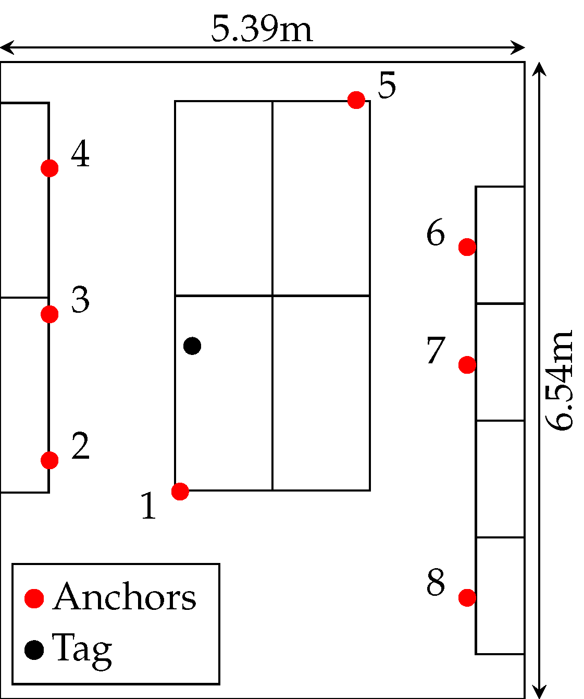
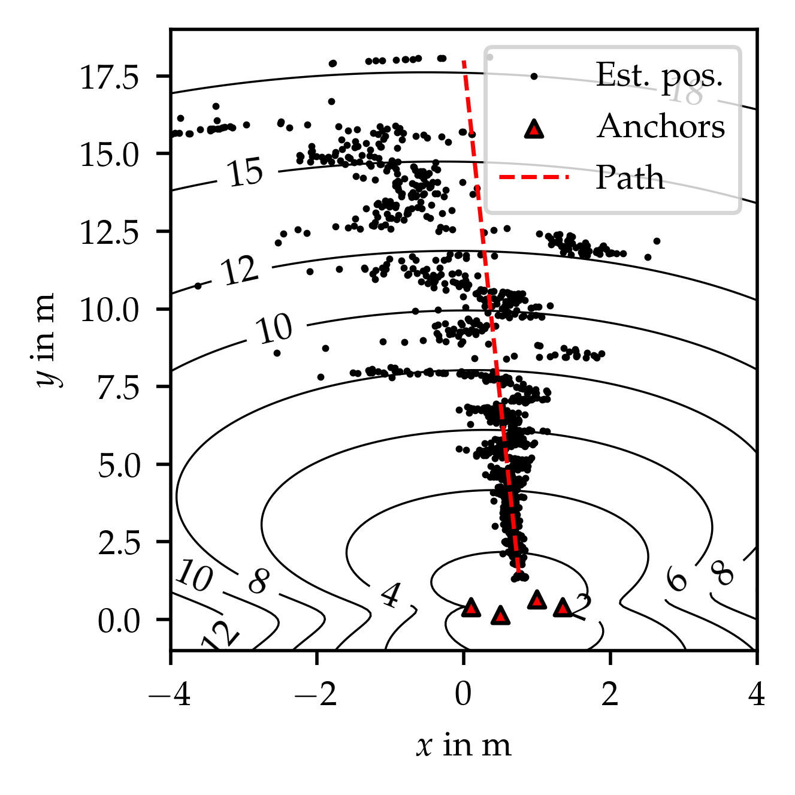

# UWB Trustworthiness dataset
In this repository two datasets are published. The first scenario refers to a localization scenario in which double-sided two-way ranging cycles carried out together with odd numbered anchors are subject to synchronization header attack ("Jammer"). The second scenario demonstrates the effect of dilution of precision in ultra-wideband localization ("Position Dilution of Precision").

## Experiment 1: Jammer
In this scenario, eight anchors are used in a static office environment, positioned at distances ranging from 1.5m to 4m to the node. A jamming device in proximity of the node is executing a synchronization header attack on four out of eight anchors, aiming at reduction of estimated distances, which further yields wrong position estimates.

## Experiment 2: Position Dilution of Precision
In this dynamic experiment, the tag first approaches the borders of the service area covered by a set of four anchors, exceeds them, and then, at a maximum distance of approximately 20 meters from the anchors, returns to its starting position. Initially, the anchors are favorably located, but as the distance increases, dilution of precision deteriorates localization quality.

# Data structure
The data is organized in csv files for portability. The provided data is summarized in the table below.

| Col. name             | Description                                                    | Example                           |
|-----------------------|----------------------------------------------------------------|-----------------------------------|
| _time                 | ISO datetime of ranging cycle                                  | "2023-05-02T19:38:00.95351Z"      |
| seqcode               | Unique for experiment(*)                                       | 0, 1381126738                     |
| seqno                 | Identifier of ranging sequence                                 | 1, 2, 3, ...                      |
| nodeid                | Identifier of anchor node                                      | "21", "22", ...                   |
| arx1                  | RX timestamp of packet a (units of 15.65ps)                    | 126327522454                      |
| arx2                  | RX timestamp of packet c (units of 15.65ps)                    | 126557619189                      |
| atx1                  | TX timestamp of packet b (units of 15.65ps)                    | 126429823816                      |
| trx1                  | RX timestamp of packet b (units of 15.65ps)                    | 561830338362                      |
| ttx1                  | TX timestamp of packet a (units of 15.65ps)                    | 561728036864                      |
| ttx2                  | TX timestamp of packet c (units of 15.65ps)                    | 561958133248                      |
| dist_correction       | Distance correction for node-anchor pairing in m               | 0.86                              |
| cir_arx1              | Channel impulse response of packet a (base64 coded)            | QwBR...Ag==                       |
| cir_arx2              | Channel impulse response of packet c (base64 coded)            | HgAa...AQ==                       |
| cir_trx1              | Channel impulse response of packet b (base64 coded)            | QABF...Ag==                       |
| cqarx1                | Diagnostics data (base64 coded)                                | QAou...CxkN                       |
| cqarx2                | Diagnostics data (base64 coded)                                | +wWT...khgN                       |
| cqtrx1                | Diagnostics data (base64 coded)                                | CgVc...WxgN                       |
| dt_arx1               | ML-based confidence of packet a                                | 0.629                             |
| dt_arx2               | ML-based confidence of packet c                                | 0.601                             |
| dt_trx1               | ML-based confidence of packet b                                | 0.641                             |
| mlbased               | ML-based trustworthiness indicator                             | 0.641                             |
| pos_x                 | Position of anchor #nodeid (x component)                       | 0.01                              |
| pos_y                 | Position of anchor #nodeid (y component)                       | 2.45                              |
| distance_ground_truth | Ground truth distance to anchor node (jammer scenario)         | 1.53                              |

(*) A ranging sequence is uniquely identified by the tuple [seqcode, seqno], a ranging cycle by [seqcode, seqno, nodeid].

Note that the first lines of the csv files are meta data used for importing to InfluxDB. They can be ignored if loaded e.g. in Python or Matlab.

# How to use this dataset
For an example how to load, access and analyze the sets, see [demo.ipynb](demo.ipynb). 

# Contact
If you have any questions please contact
- Philipp Peterseil, philipp.peterseil@jku.at

# License 
This dataset is distributed under the [Creative Commons Attributions License 4.0 (CC-BY 4.0)](https://creativecommons.org/licenses/by/4.0/).